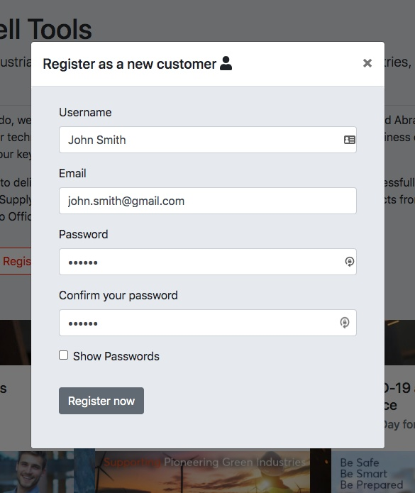

# Registration & login with MERN stack

## Table of contents

- [Purpose](#purpose-)
- [Setup](#setup-)
- [Technologies](#technologies-)
- [Screenshots](#screenshots-)
- [Improvements](#improvements-)
- [Reference](#reference-)
- [Contact](#contact-)

---

## Purpose 🎯

The aim of this project is to make an application using the MERN stack which allows a user to register, login and view their details.

## Setup 🛠️

- Clone this repo: `git clone https://github.com/rolandjlevy/registration-and-login-with-MERN.git`
- Go into the directory named `registration-and-login-with-MERN`
- Install the server dependencies by running `npm install`
- Install the client dependencies by running `npm run client-install`
- Create a `.env` file in the root directory
- Add the environment variables to the `.env` file (I will provide these in an email)
- Start the client and server with `npm run dev` then go to `http://localhost:3000`

## Technologies 👨‍💻

> Back end

- Node, Express, MongoDB, Mongoose
- Hosting database with [Mongodb Atlas](https://www.mongodb.com/cloud/atlas) cloud database
- Passwords encryted with [bcrypt](https://www.npmjs.com/package/bcrypt)
- Thorough form validation and sanitization with [express-validator](https://express-validator.github.io/docs/)
- Running the client and server simultaneously with [concurrently](https://www.npmjs.com/package/concurrently)

> Front end

- Built with [Create React App](https://reactjs.org/docs/create-a-new-react-app.html)
- Design, layout and responsiveness using [Reactstrap](https://reactstrap.github.io)
- Images from [Unsplash](https://unsplash.com/)
- Icons from [Fontawesome](https://fontawesome.com/how-to-use/on-the-web/using-with/react)

## Screenshots 📷

## Improvements 👌

> If I had more time I would do the following:

- Implement state management with Redux
- Unit testing
- JWT tokens for authentication
- Use the `he` HTML entity encoder / decoder to protect against XSS
- Use React router for page navigation
- Host the app on Heroku so it can run in the cloud

## Reference 📙

- The content and some of the design was inpired by the [Cromwell website](https://www.cromwell.co.uk)

## Contact 📧

Created by [Roland](https://rolandlevy.co.uk) - feel free to contact me!
